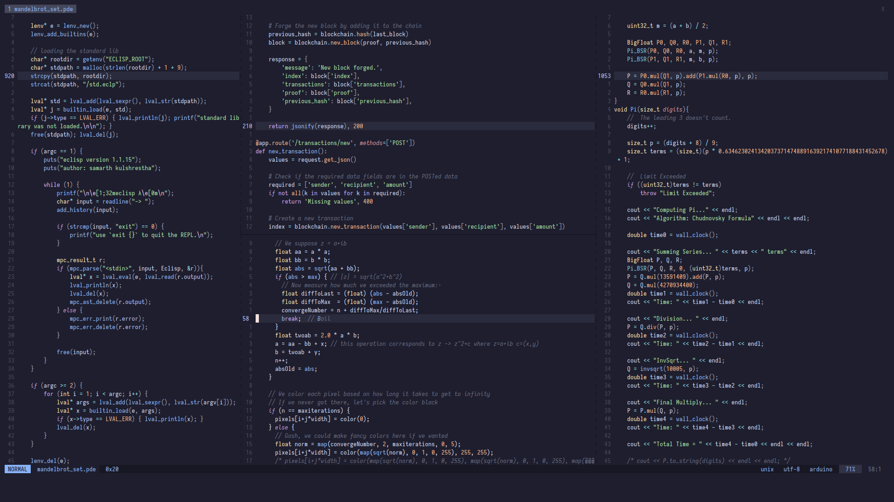

<div align="center">
<h1>nvim config</h1>

samarth kulshrestha


<br>


<br/><br/><br/>

<br/><br>
</div>

## Introduction


This is my [NeoVim](https://neovim.io) configuration. This config uses
[packer.nvim](https://github.com/wbthomason/packer.nvim) for managing plugins.
Refer to the packer readme for installation instructions.

The config is now written in [Lua](https://www.lua.org/) and each section of
the configuration has been divided into separate files, stored inside the
`lua` directory. `init.lua` then sources all of these files.

The old configuration files (both in VimScript and Lua) are stored under the
`old` subdirectory.



## Usage

These instructions are for Unix OSes (Linux, MacOS, etc).

-   Make a backup of your current config.

```
mv ~/.config/nvim ~/.config/nvim_old
```

-   Clear the NeoVim cache.

```
rm -rf ~/.local/share/nvim
```

-   Clone this repo in the correct location.

```
git clone https://github.com/samarthkulshrestha/nvim-config.git ~/.config/nvim
```

-   [Install packer.nvim.](https://github.com/wbthomason/packer.nvim#quickstart)

```
git clone --depth 1 https://github.com/wbthomason/packer.nvim\
 ~/.local/share/nvim/site/pack/packer/start/packer.nvim
```

-   Open NeoVim and type

```
:PackerInstall
```

And you're done.

## Licence

Licensed under the MIT Licence.

Copyright (c) 2023 Samarth Kulshrestha.
